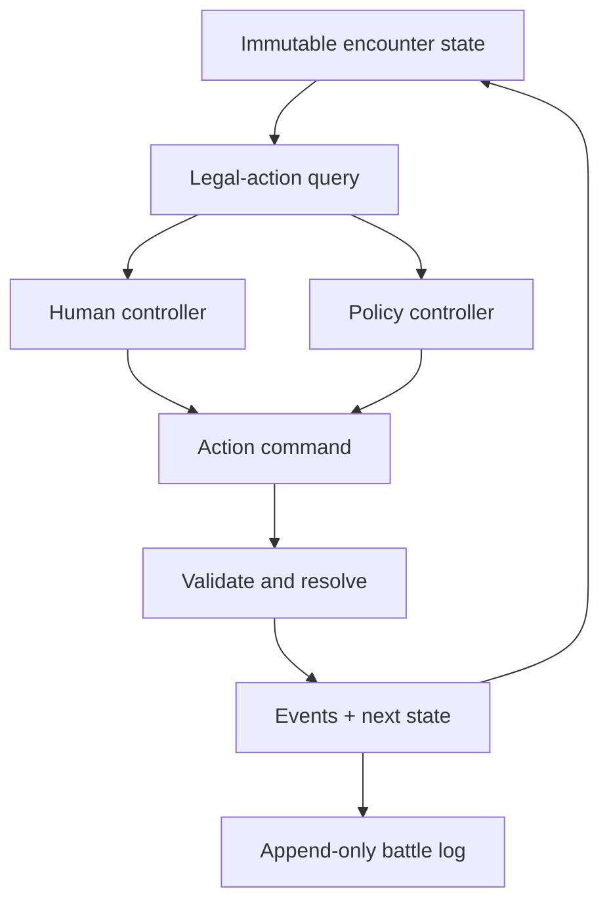

# Architecture

## Smallest viable architecture

Build a deterministic, headless, single-process rules library first. Presentation, human input, and AI are adapters around it.



## Modules

### Simulation core

- owns the authoritative state;
- exposes legal actions and target queries;
- validates commands without trusting controllers;
- resolves commands through ordered rules;
- manages turn phases and reaction windows;
- emits atomic domain events;
- receives randomness only through an injected RNG interface.

The initial implementation may use immutable copies or disciplined mutation behind a single boundary. The public contract must behave like `(state, command) -> result`.

### Controllers

A controller receives an observation plus legal-action descriptors and returns either a command or a request to pause.

- `HumanController`: waits for UI/CLI input.
- `PolicyController`: evaluates ordered rules, scores candidates, and returns a command plus explanation.
- `ScriptedController`: deterministic fixture for tests and replays.

Controllers may not access hidden state unless the perception model explicitly exposes it.

### Content definitions

Characters, abilities, effects, terrain, and encounters are data referring to a small library of rule primitives. Avoid a universal scripting language in the first prototype. Add a new engine hook only when representative content cannot be expressed compositionally.

### Presentation adapter

The first interface can be a simple 2D grid or developer UI. It:

- renders an observation;
- asks the engine for selectable actions, paths, targets, and previews;
- submits commands;
- shows the event log and AI reasoning;
- changes controller assignment at supported boundaries.

It never computes legality or damage authoritatively.

## Command lifecycle

1. Engine publishes `DecisionRequested(actor, phase)`.
2. Current controller receives an observation and legal options.
3. Controller submits a typed command carrying IDs, not object references.
4. Validator returns either structured errors or a resolution plan.
5. Resolver consumes deterministic random draws and emits events.
6. Event application creates the next authoritative state.
7. Trigger processing opens reaction windows or queues follow-up effects.
8. Terminal-state checks run.
9. Log records the command, draws, events, and explanation.

## Decision and reaction boundaries

Control assignment is read whenever the simulation requests a decision. A takeover requested during resolution becomes effective at the next boundary. This avoids rewinding partially resolved actions.

Reactions use explicit windows:

1. publish trigger and eligible reactors;
2. order reactors deterministically;
3. query each controller for react/pass;
4. validate and resolve accepted reactions;
5. resume the suspended resolution.

Nested reactions require a depth limit and an ordered stack. The prototype should permit one nested level only until tests justify more.

## Determinism and replay

A replay record contains:

- rules/content version;
- initial state or scenario ID plus loadout;
- seed and RNG algorithm version;
- ordered accepted commands;
- controller changes;
- optional AI explanations;
- emitted events and state checksums for debugging.

Replaying accepted commands is authoritative. Re-running AI from only the seed is a separate simulation comparison because policy versions may change.

## Suggested implementation shape

Keep technology choice open until the target client is chosen. The domain model should remain portable:

```
src/
  simulation/    state, commands, validation, resolution, events, RNG
  content/       character, ability, terrain, encounter definitions
  controllers/   human adapter, policy evaluator, scripted fixtures
  replay/        serialization, checksums, playback
  presentation/  prototype UI
tests/
  unit/
  scenarios/
  properties/
docs/
```

## Testing strategy

- unit tests for every rule primitive;
- scenario tests expressed as initial state + commands + expected events;
- invariants: no negative action budget, illegal occupancy, duplicate IDs, or unlogged random draws;
- replay tests comparing state checksum after every command;
- property tests for pathing, target legality, and resource conservation;
- AI-vs-AI batch runs for balance signals, never as proof of fun.
